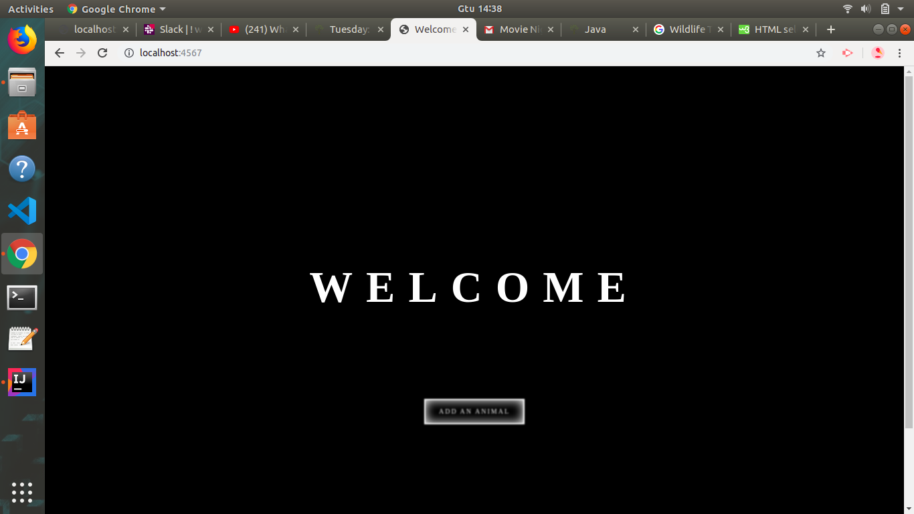
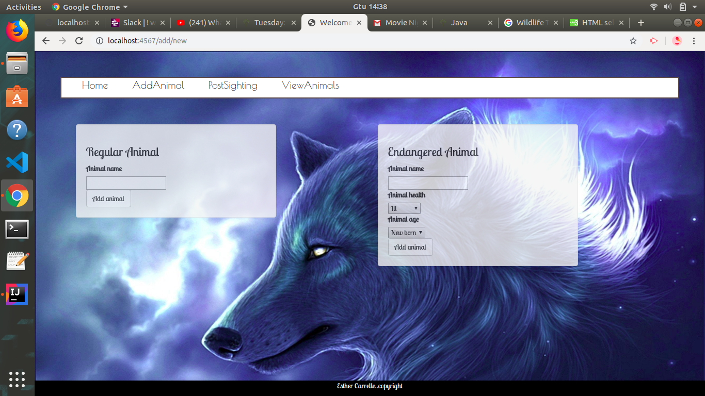
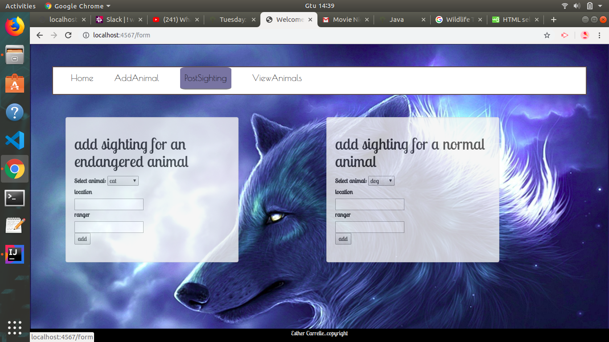
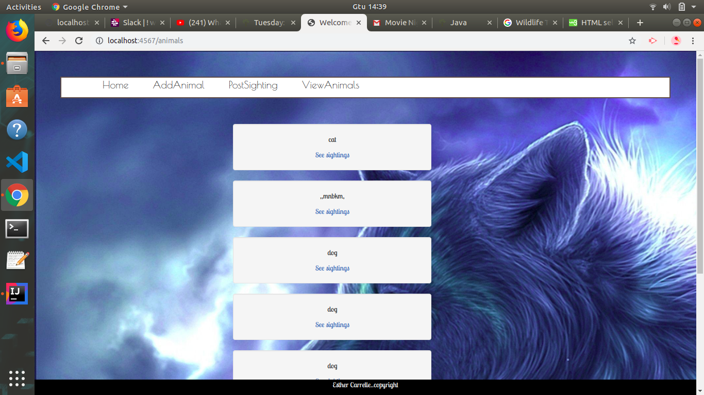
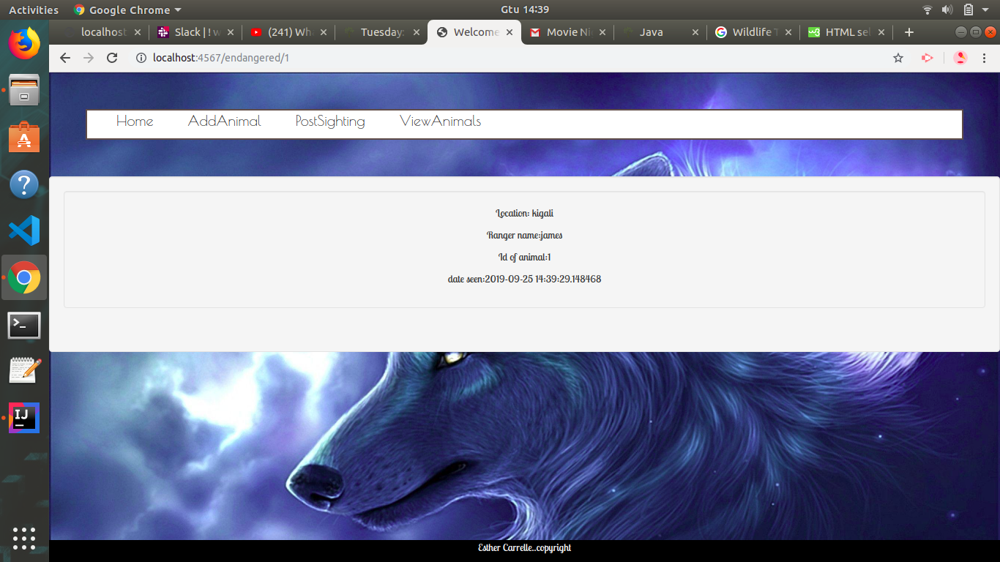

# _Wildlife Tracker_

#### By _**Esther Carrelle**_

## Description

_This is an app to track wildlife sightings in a particular area._

## Animals Class Specifications
#### Description
Tracks un-endangered animals by name.
## Images
## Description

## EndangeredAnimal Class Specifications
#### Description
Tracks endangered animals by name. Allows user to detail medical state of animal in addition to its general age.

## Sighting Class Specifications
#### Description
Tracks animal sightings with detail about animal, location, and time spotted. Attaches spotter's name to sighting.

## Ranger Class Specifications
#### Description
Tracks rangers by name and badge id.

## Setup/Installation Requirements

* _Clone this repository to your desktop_
* _In PSQL type the following command: CREATE DATABASE wildlife_tracker;_
* _In terminal, navigate to the cloned /Desktop/wildlife-tracker folder and type: psql wildlife_tracker < wildlife_tracker.sql_
* _In terminal type: $ gradle run_
* _Using a browser, make an http request to url: localhost:4567_

## Known Bugs

_None_

## Support and contact details

* _Esther Carrelle: esthcarelle@gmail.com_

## Technologies Used

_Java_
_Spark_
_JUnit_
_PostgreSQL_

### License

*This webpage is licensed under the GPL license.*

Copyright (c) 2016 **_Esther Carrelle_**
